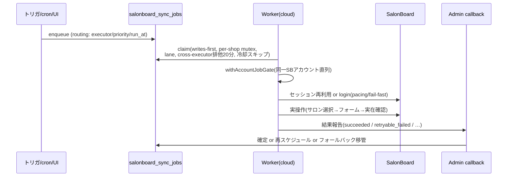
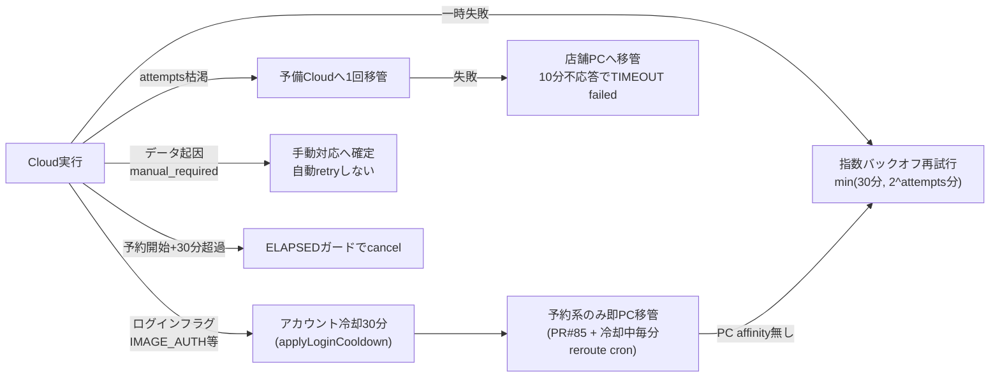

# KIREIDOT × SalonBoard 同期システム アーキテクチャ

最終更新: 2026-08-08(8/7 成功率インシデント対応後の実態を反映)

このドキュメントは現行システムの全体像・信頼性メカニズム・既知の弱点をまとめた設計レビュー用資料。
個別設計の詳細は `docs/` 配下の各設計書([write-reliability-design.md](write-reliability-design.md) 等)を参照。

---

## 0. SLOと現状達成度(2026-08-01〜08-08実測)

| SLO | 目標 | 実測 | 評価 |
|---|---|---|---|
| 書込ジョブ成功率(日次) | ≥99% | 8/2以降 99.0〜100%(8/1のみ93.7%) | ○ ただし8/7は事後修復込み |
| 実顧客予約の3分以内反映 | 100% | **85.5%**(782/915件)・p50=1.3分・**p95=21.9分** | ✗ テールが課題 |
| 処理量 | - | 約1,000〜1,500 job/日(うち予約系700〜900) | - |

**結論: 中央値は健全(1.3分)。SLO未達の主因はCAPTCHA波発生時のテール**(30分バックオフ×連鎖)。
ブラッシュアップの投資対効果は「テール潰し(§5-A)>失敗の事前排除(§5-B)>回帰防止(§5-D)」の順。

---

## 1. 全体構成図

```mermaid
flowchart TB
    subgraph External["外部サービス"]
        SB[SalonBoard / HotPepper<br/>salonboard.com]
        HP_MAIL[予約通知メール<br/>ingest+code@inbound.kireidot.jp]
    end

    subgraph Vercel["Vercel"]
        ADMIN[KireidotAdmin<br/>Next.js<br/>・管理画面/予約台帳<br/>・/api/salonboard/callback<br/>・/api/salonboard/jobs]
        SUPERADMIN[Kireidot_SuperAdmin<br/>同期監視/一括取込UI]
    end

    subgraph Supabase["Supabase (cxbqbjrx…)"]
        DB[(PostgreSQL<br/>bookings / salonboard_sync_jobs<br/>salonboard_*_imports / credentials)]
        CRON[pg_cron 19本<br/>毎分〜日次]
        EF[Edge Functions<br/>salonboard-email-ingest 等]
    end

    subgraph AWS["AWS EC2"]
        CLOUD[常時系 Cloud Worker<br/>i-0f1cc0aff1ac8dd2e<br/>docker: sb-worker-cloud<br/>executor=playwright_cloud<br/>c6i.xlarge / 並行8]
        BULK[一括系 Bulk Worker<br/>docker: sb-worker-bulk<br/>lane=bulk (移行中)]
        FB[予備 Fallback Worker<br/>i-09e54e0b55fb8ab34 (m6i.large)<br/>executor=fallback_cloud]
    end

    subgraph Local["店舗側"]
        PC[予約同期くん (Electron)<br/>Mac Studio 1台 v0.2.235<br/>executor=playwright<br/>実Chrome+拡張ブリッジ]
    end

    PROXY[Decodo Proxy<br/>static ISP 10本(書込・店舗sticky)<br/>residential(読み専用)]

    ADMIN -- "トリガ/RPCでジョブ生成" --> DB
    SUPERADMIN -- "一括enqueue RPC" --> DB
    CRON -- "定期enqueue/self-heal" --> DB
    CLOUD & BULK & FB -- "claim/heartbeat<br/>(Admin API経由)" --> ADMIN
    PC -- "claim/heartbeat" --> ADMIN
    CLOUD & BULK & FB -- "Playwright" --> PROXY --> SB
    PC -- "実Chrome(直回線)" --> SB
    SB -- "予約通知メール" --> HP_MAIL --> EF --> DB
    CLOUD & BULK & FB & PC -- "結果callback" --> ADMIN --> DB
```

### コンポーネント要点

| コンポーネント | 役割 | 備考 |
|---|---|---|
| 常時系 Cloud Worker | 予約書込(create/update/cancel)・予約取込・シフト反映などSLA対象 | main push で GH Actions 自動デプロイ(paths: worker.ts / scrapers.cjs / worker-process.cjs 等のみ) |
| 一括系 Bulk Worker | 設定系fetch(menu/coupon/staff/reviews…)・一括取込 | 2026-08-08 レーン分割移行中(claim p_lane・`salonboard_job_lane()`でfetch系=bulk) |
| Fallback Worker ×2 | Cloud書込失敗の1回だけ再試行(Cloud→FB→PC連鎖) | 2026-08-09に冗長化(単一障害点解消)。tag Role=fallback の全台へCI配布 |
| 予約同期くん(PC) | 実Chrome常駐セッションでの書込。CAPTCHA非感受 | **affinityガード: 自店舗ログイン済みの店舗のみclaim可**(現在ADER系等。Unelimit系は未設定) |
| Decodo Proxy | 書込=static ISP(店舗→IP sticky)。住宅IPは/login/拒否のため読み専用 | IP評判がCAPTCHA発生に直結 |

---

## 2. ジョブライフサイクル



### リトライ/フォールバック連鎖(書込系)



主な時間定数: read安全弁10分(Chrome kill)/cloud書込ガード5.5分/fetch再試行5分(ログイン起因は30分)・3時間で打切cancel/ログイン再試行はCAPTCHA検知で1回即中断。

---

## 3. 信頼性メカニズム一覧

| 機構 | 目的 | 実装場所 |
|---|---|---|
| writes-first claim + per-shop mutex | 書込SLA優先・店舗内直列 | claim RPC |
| withAccountJobGate | 同一SBアカウントのセッション奪い合い防止 | worker |
| cross-executor排他(20分) | Cloud/PC二重実行防止(KPCL017対策) | claim RPC |
| login pacing(endpoint/account) + CAPTCHA fail-fast | Akamaiフラグ抑止・レーン占有防止 | worker |
| アカウント冷却(blocked_until)+30分プローブ | フラグ自然減衰待ち | callback |
| 冷却中の予約系→PC毎分reroute | 冷却中のSLA維持(affinity店舗のみ) | maintenance cron |
| PC affinityガード | ログイン不能なPCへの誤移管防止 | callback/cron |
| ELAPSED 30分ガード | 過去予約の誤書込防止 | worker claim時 |
| 実在確認(予定/クーポン/掲載状態) | SBサイレント破棄の偽成功防止 | scrapers |
| 0件+文脈エラー→再試行 | 誤画面の空データ取込防止 | worker |
| orphan sweep / stale reaper / SUPERSEDED統合 | ゾンビ・重複の自動整理 | maintenance cron |
| セッション永続(userDataDir+SIGTERM flush) | デプロイ跨ぎの再ログイン抑止 | worker/docker |

---

## 4. 定期処理(主要cron)

| cron | 頻度 | 内容 |
|---|---|---|
| salonboard-sync-maintenance | */3分 | reap各種・auto match・冷却中PC reroute・stall検知・orphan再投入 |
| salonboard-reroute-stale-pc-writes | 毎分 | PC滞留45秒→cloud戻し・PC/FB 10分不応答打切 |
| salonboard-booking-sla-check | 毎分 | 予約SLA監視 |
| salonboard-cloud-settings-fetch | 03:00 JST | 全店の設定系fetch一括(10種/店・reviews のみ+15分後段) |
| salonboard-daily-shift-push | 00:00 JST | 当月+翌月シフト反映(→ブロック予定再push連鎖で深夜バースト~340件) |
| salonboard-diff-monitor-hourly | 毎時 | 差分監視 |

---

## 5. 既知の弱点と改善候補(ブラッシュアップ討議用)

### A. 可用性/SLA(優先度: 高)

1. **CAPTCHA時の代替レーン不在(Unelimit系)** — PC affinityが無い店舗はフラグ中に書込レーンがゼロ。
   - 案a: 予約同期くんにUnelimit系アカウントを追加設定(運用・最速) → タスク#200
   - 案b: PC 2台目(affinity分担・Mac Studio単一障害点の解消も兼ねる)
2. **デプロイ=コンテナ再起動の統制** — 8/7夜はデプロイ集中がコールド再ログイン波→CAPTCHA波の引き金になった疑い。
   - 案: デプロイのバッチ運用(1日N回の固定枠)+複数セッション並行時の警告。graceful drain は実装済みだが頻度自体を統制する
3. **レーン分割の完遂**(進行中) — bulk起動→常時系のlane_realtime化。一括fetchがログイン/アカウントレーンを書込と奪い合わない構造へ
4. **深夜00時バーストの平準化** — シフト連動ブロック再push約340件を00-02時に分散(タスク#209)

### B. 正しさ/検証(優先度: 高)

5. **enqueue時バリデーション** — 「実行して失敗」をゼロへ。SB上限(クーポン名36字/内容90字/5分単位)・スタッフ紐付け有無・設備マッピングをジョブ生成前に検査し、UI で即時エラー表示(タスク#201/#206系)。8/8 に旧失敗の14%(109件)がこの類だった
6. **偽成功の残り** — ブロック予定の偽成功(#203)・顧客名空(#204)。「POST受理≠保存」の実在確認をエンティティ横断で標準化
7. **ジャンル差(hair/esthetic)の一元管理** — DTO名・URL・select/inputの差分が各scraper関数に散在し、Cnk決め打ちのようなバグを量産してきた。差分表を1モジュールに集約し、全scraperがそれを参照する構造へ

### C. 観測性(優先度: 中)

8. **ジョブdebugのDB保存** — 現状docker logsのみ(SSM必須・ローテで消える)。callbackにdebug列を追加し失敗診断をAdminから見られるように
9. **メトリクス定義の明示** — ダッシュボードの窓(当日/14日)と分類(create vs ブロック)の注記。8/8朝の「0件?」問答の再発防止
10. **CAPTCHA波の自動検知アラート** — ログインフラグがN分でMアカウント超えたらSlack警報(今回は手動発見)

### D. 構造(優先度: 中〜低)

11. **scrapers.cjs(約1.6万行)の分割** — エンティティ別モジュール+実HTMLサンプル(salonboard_code/)へのパーサ単体テスト。セレクタ変更の回帰をデプロイ前に検出
12. **FBワーカーのコード同期自動化** — 手動upstream merge→CIで自動PR化(8/7はFBだけ旧コードで72件全滅の一因)
13. **リトライポリシーの単一ソース化** — worker内3回/指数/5分/30分/3h窓/冷却が多層で全体挙動の予測が困難。ポリシー表をコードとドキュメントの単一ソースに

### 直近の決定待ち(ユーザー判断)

- Unelimit系のPCアカウント追加(A-1a)を誰がいつやるか
- クーポン文言110件の短縮(一覧TSV送付済み)
- IROの見出し用ダミークーポンのSB連携対象外化
- B:ALL表参道の手動CAPTCHA解除

---

## 5.5 重点3案の具体設計

### 案① CAPTCHA避難レーン(A-1) — p95テールの根治

SLO未達15%のほぼ全てがログインフラグ由来。PC(実Chrome常駐)はフラグ非感受・claim中央値2秒・平均処理10秒で、避難先として実証済み。ギャップは「affinity(PCが対象店舗にログインしているか)」のみ。

| 選択肢 | 効果 | コスト/リスク |
|---|---|---|
| a. 既存Mac StudioにUnelimit系アカウントを追加ログイン | 最速(運用作業のみ)。全店舗にPC避難レーンが開通 | Mac Studio単一障害点は残る。同時セッション数増による拡張ブリッジ負荷は要観測 |
| b. PC 2台目を追加しaffinity分担 | 単一障害点解消+容量倍増 | ハード調達+セットアップ。運用対象が2台に |
| c. クラウド上に「実Chromeプロファイル箱」を建てPC相当に | ハード不要でスケール | SB/Akamaiに新環境として検知されるリスク。実質PCと同じものを作る作業 |

**推奨: a を即実施 → 安定後に b で冗長化**。c は a/b で不足した場合のみ。
実装済みの受け皿: 失敗時即PC移管(callback)+冷却中毎分PC reroute(cron)は affinity さえあれば全店で機能する。

### 案② enqueue時バリデーション(B-5) — 「実行して失敗」の事前排除

8/8時点の失敗在庫497件中、約26%(126件)は実行前に判定可能だった:

| チェック | 件数実績 | 実装ポイント |
|---|---|---|
| クーポン名≤36字/内容≤90字 | 102 | menus/coupons保存時のserver action+`kireidot_menu_updated`トリガのenqueue前 |
| 施術時間5分単位 | 7 | 同上 |
| 担当スタッフのSB紐付け存在 | 7(実顧客2件被害) | 予約作成/変更のserver action+push_booking enqueue関数 |
| フォト投稿のスタイリスト必須 | 9 | 投稿UI必須化+enqueue関数 |
| 設備マッピング存在 | 3 | enqueue関数(警告のみでも可) |

方式: **DB側のenqueue関数/トリガに検査を追加し、違反はジョブを作らず `salonboard_sync_alerts`(新設 or 既存ログ)に「要修正」として記録→Admin UIバッジ表示**。
ジョブ化しないので成功率指標も汚れず、ユーザーは修正箇所を即座に知れる。工数目安: DB+Admin 1〜2日。

### 案③ ジャンル差の一元管理(B-7) — Cnk決め打ち系バグの構造的撲滅

これまでの同型バグ: reviews URL(7月)・push_staff genre(7月)・クーポンDTO(8月)・施術時間select(8月)。
散在する hair/esthetic 分岐を1モジュールに集約する:

```js
// electron/sb-genre-map.cjs (新設イメージ)
module.exports = {
  esthetic: {
    draftRoot: '/CNK/draft/', reserveRoot: '/KLP',
    couponEditDto: null,          // 末尾一致で参照するため接頭辞は持たない
    durationField: { kind: 'input', suffix: '.sejyutsuAimTime' },
    reviewList: '/KLP/review/reviewList/',
  },
  hair: {
    draftRoot: '/CNB/draft/', reserveRoot: '/CLP/bt',
    durationField: { kind: 'select', suffix: '.sejyutsuAimTime' },
    reviewList: '/CLP/bt/review/reviewList/',
    groupTop: '/CNC/groupTop/',
  },
};
```

移行は「新規修正時にこのマップ参照へ書き換える」漸進方式(ビッグバン不要)。
併せて `salonboard_code/` の実HTMLサンプルに対する**パーサ単体テスト**(node:test)をCIに追加し、セレクタ回帰をデプロイ前に検出する(D-11の第一歩)。

---

## 5.6 リトライポリシー表(現行の単一ソース・D-13)

| 事象 | 1次対応 | 再試行 | 打切 |
|---|---|---|---|
| 書込の一時失敗 | 指数バックオフ | min(30分, 2^attempts分) | attempts=max→FB→PC→failed |
| 書込のログインフラグ | アカウント冷却30分+予約系は即PC移管 | 冷却明けプローブ(30分毎) | フラグ減衰まで(実測3〜4h) |
| fetchの一時失敗 | 5分後cloud再試行 | 5分間隔 | 作成から3hでcancel |
| fetchのログインフラグ | 30分後cloud再試行 | 30分間隔 | 同上 |
| データ起因(manual_required) | 即確定・自動retryなし | - | 手動修正待ち |
| 予約開始+30分超過 | ELAPSEDガードでcancel | - | - |
| read実行10分 | Chrome kill(安全弁) | ジョブ再試行に委ねる | - |
| PC/FB移管先10分不応答 | TIMEOUT failed / cloud戻し | - | - |

---

## 7. ロードマップ(提案)

| フェーズ | 期間目安 | 内容 | 効果 |
|---|---|---|---|
| P1: テール潰し | 今週 | A-1a(PCへUnelimitアカウント追加・運用作業)+CAPTCHA波アラート(C-10) | 3分SLO 85.5%→98%+ |
| P2: 事前排除 | 来週 | B-5 enqueueバリデーション一式+メトリクス注記(C-9) | データ起因失敗ゼロ化・指標の信頼性 |
| P3: 回帰防止 | 今月中 | B-7ジャンルマップ+パーサテストCI(D-11着手)+FB同期自動化(D-12)+debug DB保存(C-8) | 同型バグの再発防止・調査コスト減 |
| P4: 構造 | 来月 | レーン分割完遂(A-3)+深夜バースト分散(A-4)+PC 2台目(A-1b)+scrapers分割本格化 | 冗長化・保守性 |

---

## 8. 関連資料

- 書込信頼性設計: [write-reliability-design.md](write-reliability-design.md)
- 書込IP/プロキシ構成: [salonboard-write-ip-architecture.md](salonboard-write-ip-architecture.md)
- FBワーカー: [fallback-cloud-worker.md](fallback-cloud-worker.md)
- シフト同期設計: [shift-parity-design.md](shift-parity-design.md)
- クラウドスクレイピング基盤: [salonboard-cloud-scraping.md](salonboard-cloud-scraping.md)

---

## 9. 2026-08-09 に踏んだ罠 (再発防止メモ)

| 罠 | 症状 | 対策 |
|---|---|---|
| **PostgRESTはRPCのオーバーロードを解決できない** | claimに引数を1つ足した(5→6引数)ところ旧版が残り、全ワーカーのジョブ取得が500で停止(14分) | シグネチャを変える migration には**旧版のDROPを必ず同梱**する。`select p.oid::regprocedure from pg_proc where proname='...'` で1つだけになったか確認 |
| **新規箱でバンドルのbind-mount忘れ** | ECR同梱の古いworker.cjsで起動し、修正済みバグが再発 | `docker run` に `-v /opt/kireidot/worker.cjs:/app/worker.cjs:ro`。確認は `docker inspect <名前> --format "{{len .Mounts}}"` が1 |
| **AL2023にcronが無い** | `/etc/cron.daily/` に置いた掃除スクリプトが一度も動かない | systemd timer を使う(`scripts/setup-debug-cleanup-timer.sh`)。`systemctl list-timers` で登録確認 |
| **ログイン後プローブが別ジャンルのTOPを叩く** | hair店のログイン直後に `/KLP/top/` を踏み、SBのセッション失効ページで自分のセッションを破壊 | genre/グループでプローブ順を出し分け(hairは `groupTop→/CLP/bt/top/` のみ) |
